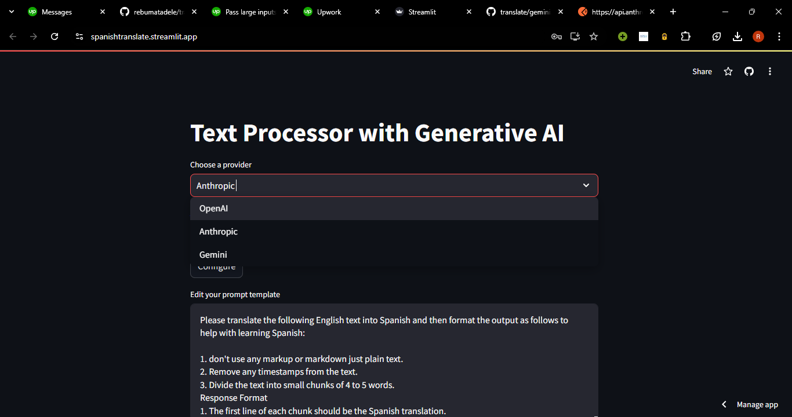

# Text Processor with Generative AI

## Overview

This project is a **Text Processor with Generative AI** that enables interaction with multiple AI providers: **Claude**, **OpenAI**, and **Gemini**. Users can generate text completions or summaries by uploading a file, editing input text, and selecting the desired AI provider and model.

## The Look

## Features

1. **Multiple Provider Integration**:
   - Supports Claude (Anthropic), OpenAI, and Gemini (Google Generative AI).
   - Provides flexibility to choose from different AI models based on your needs.

2. **Editable Prompt Section**:
   - Modify the prompt before processing.
   - Save changes directly to the file if needed.

3. **Input File Editing**:
   - Upload a text file and preview it before processing.
   - Edit the content of the file directly within the app.

4. **Output Preview**:
   - Preview the generated output before downloading it.
   - Ensure the accuracy and quality of the result before saving it.

5. **Auto-Filled API Key Fields**:
   - Automatically retrieves API keys from the `.env` file.
   - Allows for easy configuration without manual key entry each time.

6. **Multiple API Provider Selection**:
   - Select from different AI providers to enhance the accuracy of the output.
   - Offers multiple choices to suit diverse requirements.

7. **Progress Bar**:
   - A visual progress bar to indicate the completion status of the task.
   - Provides real-time feedback as your text is processed.

8. **Deployed Application**:
   - Successfully deployed and available for use.
   - Simplifies interaction with AI providers via a streamlined interface.

9. **Model Selection for OpenAI**:
   - Choose between different GPT models (e.g., GPT-3.5-turbo, GPT-4).
   - Tailor the output quality and performance to your needs.